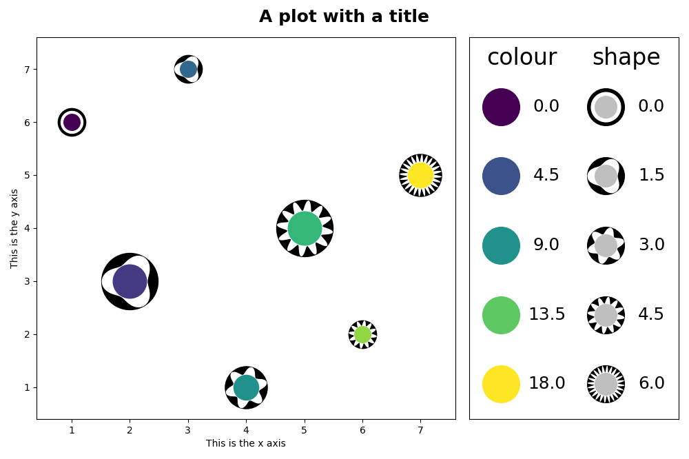
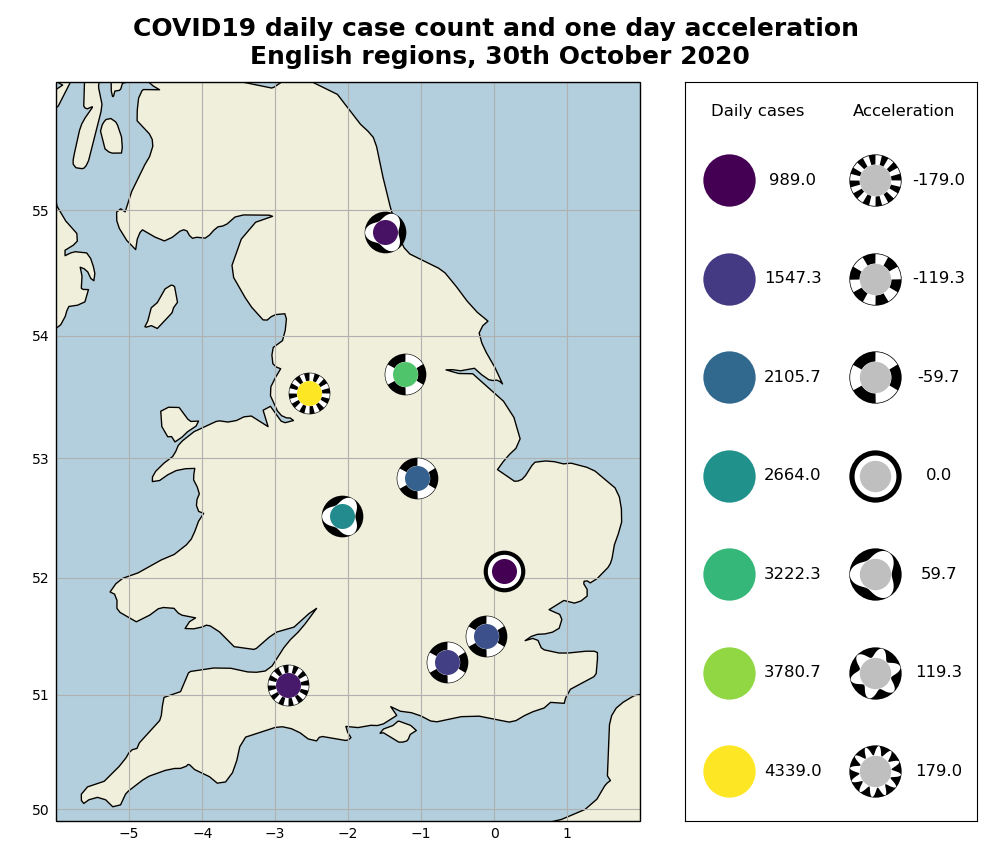
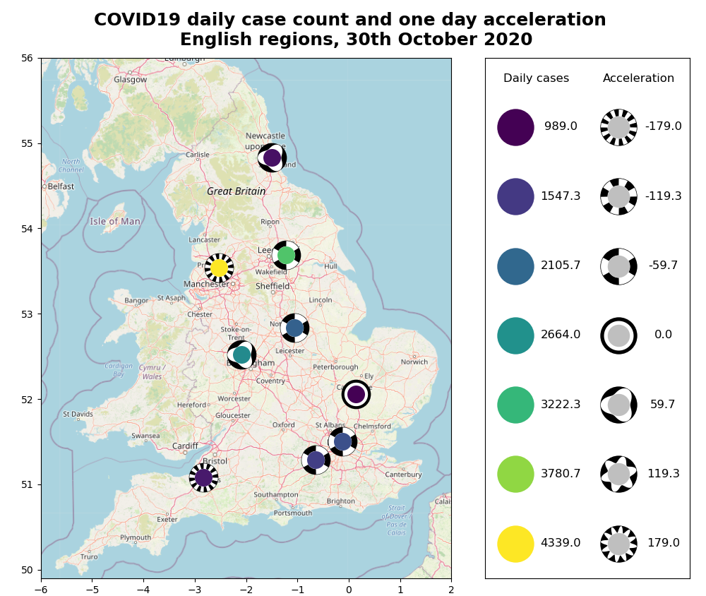
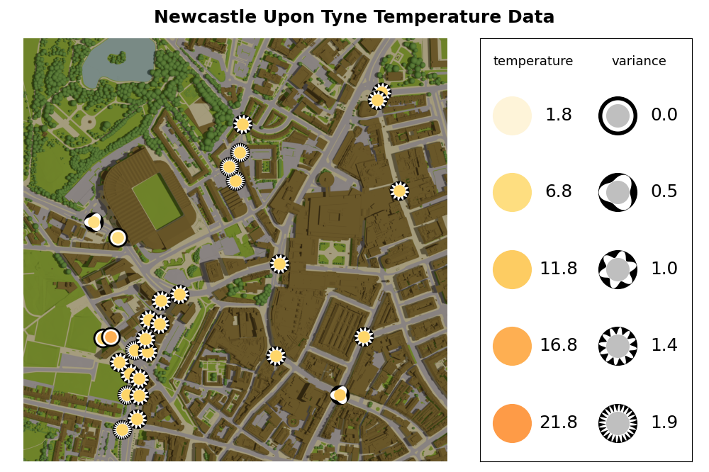
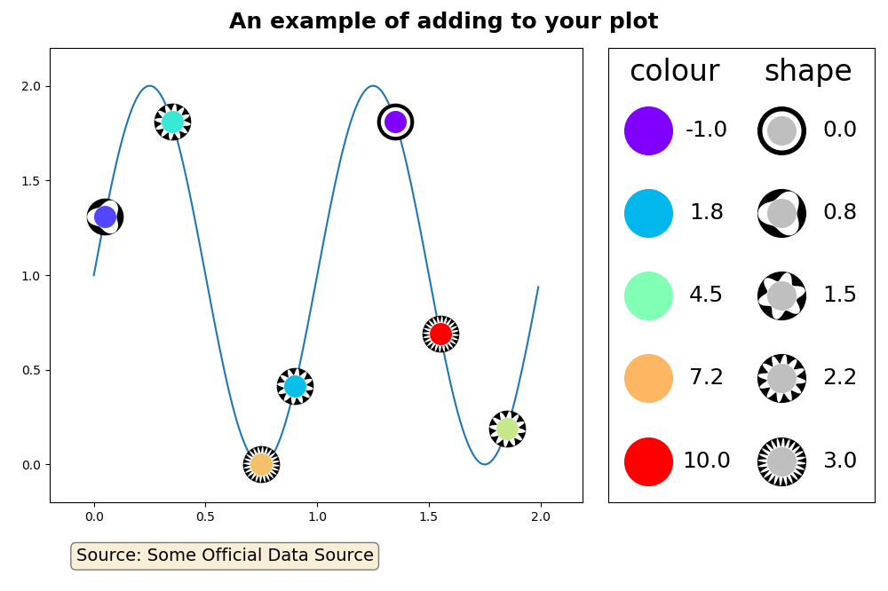

# vizent

<br/>   
 


> A python library for bivariate glyphs integrated with matplotlib

This library allows the user to create scatter plots and node-link diagrams using Visual Entropy Glyphs[1] and network edges [2]. Vizent glyphs and network edges are designed to help when you need to add an extra variable to a scatter plot, map, or graph.

Vizent glyphs are bivariate, that is they allow you to represent two variables at each point on your plot. A central colored disc is able to represent a continuous variable, an enclosing shape can represent a continuous interval or categorical variable using increasing levels of visual entropy (shape complexity). 

Vizent network edges enable additional bivariate data representation and can be used in combination with the glyphs. The edges represent data via colored edges and a visual entropy component on top of the colored edge capable of representing ordered data.

Applications for the Vizent glyphs include: 
* when you need represent uncertainty at a point or edge, eg a mean and a standard deviation
* when you need to represent derivatives at a point or edge, eg a rate and an acceleration
* any other pair of values at a point on a plot or on a network edge.

The vizent library provides an interface to matplotlib axes and figures that supports the drawing of vizent glyphs and network edges. The matplotlib artists, figures and axes objects are returned for further editing using the broader matplotlib library if required.

The library also provides functionality to plot vizent glyphs and networks edges with a map background (requires [Cartopy](https://scitools.org.uk/cartopy/docs/latest/)) or using an image provided by the user (requires [pillow](https://pillow.readthedocs.io/en/stable/)).

The [gallery](docs/_build/gallery.html) gives example plots demonstrating the library capability. A more detailed tutorial is also available [here](https://medium.com/nightingale/rising-or-falling-visualizing-the-trends-in-the-daily-covid-19-situation-e5ae3044fcef).


## Installation

vizent can be installed using [pip](https://pip.pypa.io/en/stable/)

```sh
pip install vizent
```
[vizent on PyPI](https://pypi.org/project/vizent)

Dependencies:
* matplotlib
* numpy
* scipy

Optional dependencies:
* pillow (for image backgrounds)
* cartopy (for map backgrounds)


## Using vizent

Library documentation is available at: [TODO: Add readthedocs link]

## Glyph Designs

The available glyph shape designs are shown here in full. Value increases with frequency from left (lowest) to right (highest).

### sine

### saw

### reverse_saw

### square

### triangular

### concave

### star


## Examples

### Create a basic scatterplot:

```python
from vizent import vizent_plot

x_values = [1,2,3,4,5,6,7]
y_values = [6,3,7,1,4,2,5]
color_values = [0,3,6,9,12,15,18]
shape_values= [0,1,2,3,4,5,6]
size_values = [30,60,30,45,60,30,45]

vizent_plot(x_values, y_values, color_values, shape_values, size_values,
            color_label="color", shape_label="shape",
            title="A plot with a title", x_label="This is the x axis",
            y_label="This is the y axis")
```


### Create a map using Cartopy:

```python
from vizent import vizent_plot
import pandas as pd

data = pd.read_csv("englandRegions.csv")
x = data['long'].tolist()
y = data['lat'].tolist()
cases = data['dailyCases'].tolist()
accel = data['accel'].tolist()

size = [30]*len(x)
extent = [-6, 2, 49.9, 56]

vizent_plot(x, y, cases, accel, size, shape_label="Acceleration", 
            color_label="Daily cases", use_cartopy=True, extent=extent, 
            title='COVID19 daily case count and one day acceleration \n'
            'English regions, 30th October 2020') 
```


### Create a map of england using an image background:

```python
from vizent import vizent_plot
import pandas as pd

data = pd.read_csv("englandRegions.csv")
x = data['long'].tolist()
y = data['lat'].tolist()
cases = data['dailyCases'].tolist()
accel = data['accel'].tolist()

size = [30]*len(x)

vizent_plot(x, y, cases, accel, size, shape_label="Acceleration",
            color_label="Daily cases", use_image=True,
            image_type="england", title="COVID19 daily case count and one "
            "day acceleration \n English regions, 30th October 2020")
```



Map © [OpenStreetMap](https://www.openstreetmap.org/) contributors

### Use detailed background images of Newcastle Upon Tyne:

```python
from vizent import vizent_plot
import pandas as pd

data = pd.read_csv("cleaned_temp_data.csv")
eastings = data['easting'].tolist()
northings = data['northing'].tolist()
average = data['Average of Value'].tolist()
variance = data['Variance of Value'].tolist()

size = [20]*len(eastings)

vizent_plot(eastings, northings, average, variance, size, 
            "metoffice", shape_label="variance", 
            color_label="temperature", use_image=True, 
            image_type="newcastle", color_spread=20,
            title="Newcastle Upon Tyne Temperature Data",
            show_axes=False)
```


### Add your own MatPlotLib elements to the plot:

```python
from vizent import vizent_plot
import numpy as np

# Let's take an example of a vizent plot and add to it

x = [0.05,0.35,0.75,0.9,1.35,1.55,1.85]
y = [(1 + np.sin(2 * np.pi * i)) for i in x]
color_values = [0,3,7,2,-1,10,6]
shape_values = [1,2,3,2.3,0,3,2]
size = [30,30,30,30,30,30,30]

# Assign the output of the function to fig, ax as shown

fig, ax = vizent_plot(x, y, color_values, shape_values, size, 
                      colormap="rainbow", shape_label="shape", 
                      color_label="color", return_axes=True, 
                      title="An example of adding to your plot")

# Let's add a line to the plot

t = np.arange(0.0, 2.0, 0.01)
s = 1 + np.sin(2 * np.pi * t)

# Adjust zorder to control whether line is behind or in front of points, 
# background image etc. In this case, zorder=0 places the line behind the 
# points while zorder=1 would place it in front. If using a background
# image, zorder=0.5 places the line in front of the background image, 
# but behind the points.

ax.plot(t, s, zorder=0)

# Let's also add a text box with some additional information, such as the 
# data source

props = dict(boxstyle='round', facecolor='wheat', alpha=0.5)
text = "Source: Some Official Data Source"

# Text box position can be adjusted

ax.text(0.05, -0.1, text, transform=ax.transAxes, fontsize=14,
        verticalalignment='top', bbox=props)

# And you can adjust the space around the subplot to ensure the text box
# is shown if it is outside of the axes

plt.subplots_adjust(bottom=0.15)

plt.show()
plt.close()  
```


  

## Release History

* 1.0 First release 24/02/2021
* 1.1 Added vizent network edges 13/09/2023

## Meta

[vizent on github](https://github.com/cusp-london/vizent)

[vizent on PyPI](https://pypi.org/project/vizent)

Distributed under the MIT license. See ``LICENSE`` for more information.

Acknowledgments: The Alan Turing Institute for funding the Newcastle Seedcorn project "Automating visualization", under the EPSRC grant EP/N510129/1 and for Nick Holliman's Turing Fellowship.

[1] "Visual Entropy and the Visualization of Uncertainty", Holliman et al, arXiv:1907.12879

[2] "Visualising ordered bivariate data on node-link diagrams", O Akbulut, L McLaughlin, T Xin et al. Visual Informatics (2023) [doi:10.1016/j.visinf.2023.06.003](https://doi.org/10.1016/j.visinf.2023.06.003)