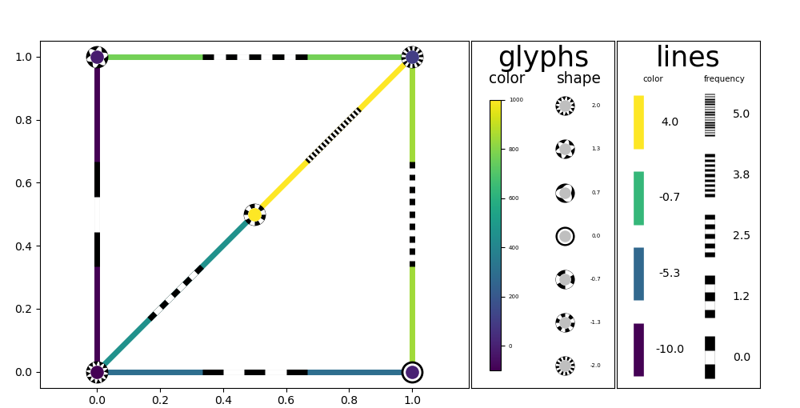
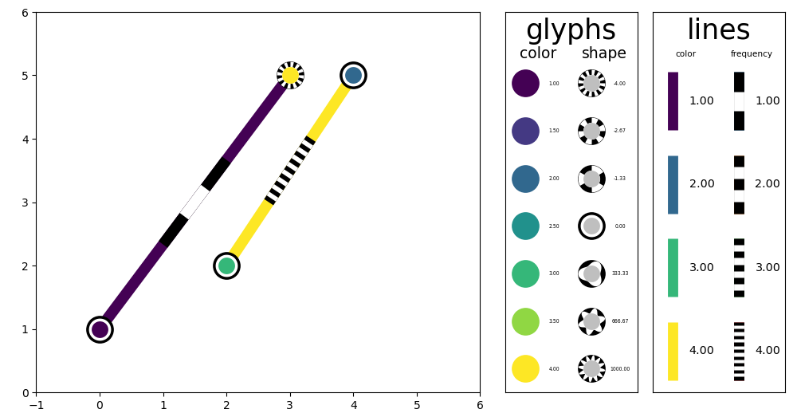
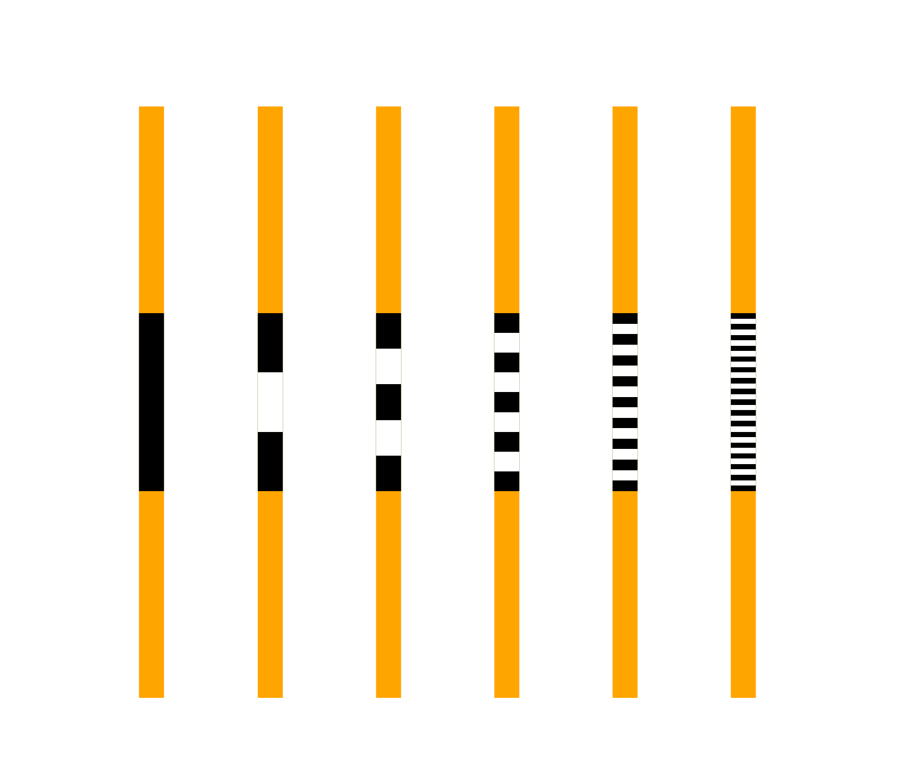

User Guide
==========

The Vizent library provides an interface for the plotting of bivariate data on points and edges. 

For points, the bivariate data is displayed via a set of glyphs that encode two channels of information via a central colored point, whose colors vary according to a primary quantity, and by a surrounding shape with varying frequencies as determined by a secondary quantity. Different shapes are available (see section on Glyph Designs below) that can encode a diverging scale.

For edges, a coloured line provides the primary channel for displaying information, with a secondary channel given by a line segment with alternating black and white stripes. The frequency of these stripes encode the data provided.

Create a vizent plot
********************

The :code:`vizent_plot()` function provides a convenient wrapper to produce vizent plots. A simple example is provided below.

.. code-block:: python

  x_values = [0, 0, 1, 1, 0.5]
  y_values = [0, 1, 0, 1, 0.5]

  color_values = [-100, -10, 0.01, 100, 1000]
  shape_values = [2, 1, 0, -2, -1]
  
  edge_color_values = [-10, -5, -3, 1, 2, 4]
  edge_freq_values = range(6)
  color_values = [-100, -10, 0.01, 100, 1000]
  shape_values = [2, 1, 0, -2, -1]

  # Build a sample network based on these points
  x_start = []        
  x_end = []
  y_start = []
  y_end = []
  for x1,y1 in zip(self.x_values, self.y_values):
      for x2,y2 in zip(self.x_values, self.y_values):
          if x1 <= x2 and y1 <= y2:
              line_distance =  np.sqrt((x1 - x2)**2 + (y1 - y2)**2)
              if line_distance <= 1 and line_distance > 10e-5:
                  x_start.append(x1)
                  y_start.append(y1)
                  x_end.append(x2)
                  y_end.append(y2)

  fig = vizent_plot(x_values=x_values,
                    y_values=y_values, 
                    colour_values=color_values, 
                    shape_values=shape_values,
                    size_values=[20 for i in range(len(self.x_values))],
                    edge_start_points=[(x,y) for x,y in zip(x_start, y_start)], 
                    edge_end_points=[(x,y) for x,y in zip(x_end, y_end)], 
                    edge_colors=edge_color_values,
                    edge_frequencies=edge_freq_values, 
                    edge_widths=[5 for i in range(len(x_start))],
                    edge_color_n=4, 
                    scale_x=15)

Using the vizent pipeline
*************************

Finer-grained control is possible by using the vizent pipeline, comprising of a sequence of four function calls, described below.

1. :code:`create_plot()`: Prepare the plotting area with spacing for required legends and possible background images.
2. :code:`add_glyphs()`: Add vizent glyphs to the plot, with added options for the appearance of the points and legend.
3. :code:`add_lines()`: Add vizent lines to the plot, with added options for the appearance of the points and legend.
4. :code:`return_figure()`: Provides a convenience function for handling the resulting image.

An example of this pipeline is given below: 

.. code-block:: python

    # First the plot area is prepared. This includes specifications
    # relating to the axes, plot area background and legends.

    axes=create_plot(use_image=True, image_file="image.jpg", 
                     extent=[0,6,0,6])

    # Next any glyphs and lines are added. This can be done in any 
    # order, glyphs will always be placed on top of lines.

    x_values = [1,4,2,3]
    y_values = [1,5,2,5]
    color_values = [1,2,3,4]
    shape_values = [1,2,3,4] 
    size_values = [30,30,30,30]

    add_glyphs(axes, x_values, y_values, color_values, shape_values, 
               size_values)

    x_starts = [2,1]
    y_starts = [2,1]
    x_ends = [4,3]
    y_ends = [5,5]
    color_values = [4,1]
    shape_values = [4,1] 
    width_values = [15,15]

    add_lines(axes, x_starts, y_starts, x_ends, y_ends, color_values, 
              shape_values, width_values)

    # Finally, the created figure is returned in the required manner.
              
    return_figure(axes, "display")

Glyph Designs
*************

The available glyph shape designs are shown here in full. Value increases with frequency from left (lowest) to right (highest).

sine
----

.. image:: _static/glyphs/sine.png
  :alt: sine glyphs

saw
---

.. image:: _static/glyphs/saw.png
  :alt: saw glyphs

reverse saw
-----------
.. image:: _static/glyphs/reverse_saw.png
  :alt: reverse saw glyphs

square
------
.. image:: _static/glyphs/square.png
  :alt: square glyphs

triangular
----------
.. image:: _static/glyphs/triangular.png
  :alt: triangular glyphs

concave
-------
.. image:: _static/glyphs/concave.png
  :alt: concave glyphs

star
----
.. image:: _static/glyphs/star.png
  :alt: star glyphs

Line Samples
************

Default sample lines for a variety of frequency values are shown below. The left-most line is used when the data contains numpy.nan (i.e. for missing data).

